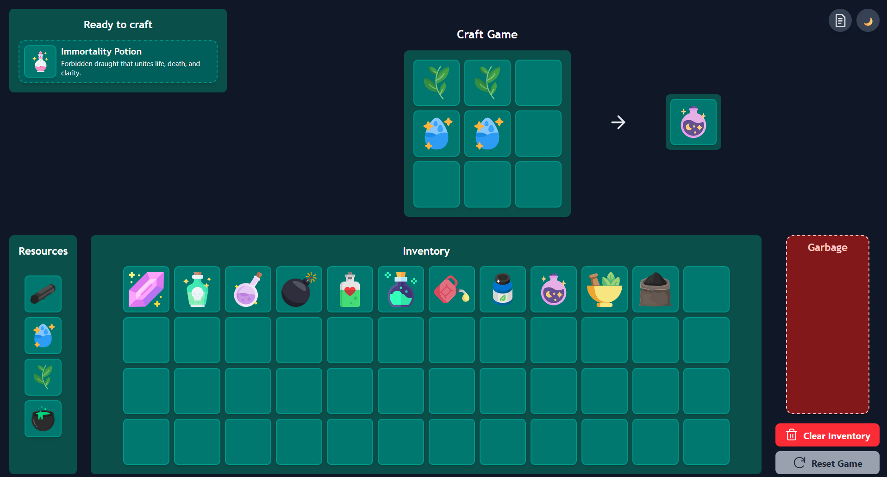

# Crafting Game in React

## Overview
This project is a crafting game built with React + TypeScript (using Vite). Players can collect resources, combine them to craft new items, and track their progress through a discovery system.

The theme of items and recipes is customizable and stored in JSON files, making the game easy to extend with new ingredients and crafting rules.

## Project Setup & Architecture
- Built with Vite for fast development and optimized builds.
- Entirely written in TypeScript for better type safety and maintainability.
- Resources and recipes are stored in dedicated .json files.
- UI styling is implemented using CSS Modules (or any preferred styling solution).
- Drag-and-drop is implemented manually using the native HTML Drag and Drop API.

## Features
### 1. Inventory & Resources
- Players have access to infinite basic resources.
- Items can be moved, organized, or deleted from the inventory.
  
### 2. Crafting System
- Each recipe has a specific set of required ingredients and produces a unique result.
- The system automatically detects valid recipes as items are placed on the crafting board.
- Crafted items are previewed before confirmation and then automatically added to the inventory.

### 3.Discovery Panel
- Displays all items that the player has already discovered.
- Shows the crafting model for each discovered item.
  
### 4. Possible Recipes Panel
- Suggests items that can be crafted with currently available resources.
- Provides hints about the necessary ingredients to encourage experimentation.

### 5. Persistence & Progress
- Player progress is saved in localStorage (inventory and discovered items).
- Includes a reset option for restarting the game.
- Features a victory condition when the final item is crafted.

### 5. Theme Switching
- The app supports both light and dark themes.

## Demo
You can try the game here: [Potion Craft Game](https://potion-craft-game.vercel.app/).